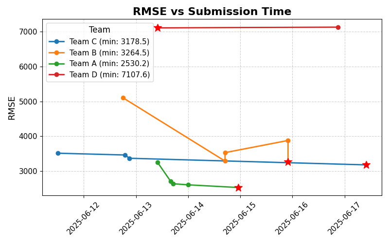

# Term Project #3: Hourly Energy Demand in South Korea
## 📊 RMSE Leaderboard

| 순위 | 팀 이름 |   RMSE   |
|------|--------|----------|
| 1    | 팀 A    | 2530.151 |
| 2    | 팀 C    | 3178.504 |
| 3    | 팀 B    | 3264.466 |
| 4    | 팀 D    | 7107.612 |

> 🔁 가장 최근 제출 중 **가장 낮은 RMSE**만 기록됩니다.
> ⏱️ 마지막 업데이트: 2025-06-17 17:10 (KST)

---

## ⚠️ Error Log (형식 오류 또는 처리 실패)
| 파일명 | 에러 내용 |
|--------|------------|
| 20250612_223125_power_demand_in_2023_team_[A].csv | 팀명을 인식할 수 없음 (team_[A-D] 형식 아님) |
| 20250612_223455_2023_PW_Prediction.csv | 팀명을 인식할 수 없음 (team_[A-D] 형식 아님) |
| 20250612_234855_power_demand_in_2023_team_[A].csv | 팀명을 인식할 수 없음 (team_[A-D] 형식 아님) |
| 20250614_171001_power_demand_in_2023_team_B.csv | 'values' |
| 20250614_172025_power_demand_in_2023_team_B.csv | 'values' |
| 20250616_201809_power_demand_in_2023_team_D.csv | Found input variables with inconsistent numbers of samples: [8760, 365] |
| 20250616_232819_power_demand_in_2023_team_B.csv | Found input variables with inconsistent numbers of samples: [8760, 8568] |
| 20250616_232904_power_demand_in_2023_team_B.csv | Found input variables with inconsistent numbers of samples: [8760, 8568] |

---

## 1. About the Dataset

### 📊 한국전력거래소_시간별 전국 전력수요량
- 시간 단위 전국 발전단 수요 데이터이며, 수요예측용 잠정자료입니다.  
- 단위: **MWh**  
- 해당 데이터는 **육지 및 제주**를 모두 포함합니다.  
- 출처: [한국전력거래소](https://www.data.go.kr/data/15065266/fileData.do#layer_data_infomation)

### 🌡️ 기상청_일별 전국평균온도
- 일별 전국의 **일평균 / 최고 / 최저** 기온 데이터입니다.  
- 전력 수요와 달리, 온도는 **하루 단위**로 기록되며 시간 해상도 차이가 있습니다.  
- 출처: [기상청](https://data.kma.go.kr/stcs/grnd/grndTaList.do)

---

## 2. Project Objective

- 주어진 자료를 활용하여 **2023년 1월 1일부터 2023년 12월 31일까지의 시간별 전력 수요량**을 예측합니다.
- 기온 외에도 에너지 수요와 관련 있는 **추가적인 feature**를 자유롭게 생성할 수 있습니다.  
  → **새로운 feature 개수에 따라 가산점 부여**
- 수업에서 다룰 **XGBoost** 외에도 유사 문제를 해결할 수 있는 **다양한 모델 시도**가 가능합니다.  
  → **타당한 시도일 경우 가산점 부여**
- Tree 기반이 아닌 모델을 사용할 경우, **적절한 데이터 전처리**가 필요합니다.

---

## 3. Submission Guidelines

- 팀별로 예측 결과를 `.csv` 파일 형식으로 제출합니다.  
- 하루에 최대 **3개**까지 제출 가능하며, **RMSE 기준**으로 매일 자정 리더보드를 업데이트합니다.
- 제출 방법:
  - 이메일 제출: 조교 박은실 & 설정환에게 전달
  - 파일명 형식:  
    `power_demand_in_2023_team_[A-D].csv`  
    → `[A-D]`는 팀 구분용 알파벳
  - 파일 형식:
    - 컬럼: **1개 ("values")**
    - Row 순서: **2023-01-01 00:00** ~ **2023-12-31 23:00**  
      → 총 8760개 row, **오름차순 정렬 필수**
    - 형식을 지키지 않을 경우 **채점 시스템 오류 발생**

---

## 4. Evaluation Criteria

- 보고서 제출은 **생략**합니다.
- 채점은 다음 기준으로 이루어집니다:
  - 예측 정확도 (RMSE 기반) **50점**  
    - 1등: 50점  
    - 2등: 45점  
    - 3등: 40점  
    - 4등: 35점
  - 발표: **30점**
  - 팀원 간 평가: **20점**

---

본 Repository는 **인하대학교 에너지자원공학과**  
📘 *2025년 봄학기 "에너지빅데이터"* 강의의 Term Project 용도로 사용됩니다.

**Project Owners:**  
👨‍🏫 편석준 교수님  
👨‍💻 조홍근, 박은실, 설정환

## ⚠️ Error Log (형식 오류 또는 처리 실패)
| 파일명 | 에러 내용 |
|--------|------------|
| 20250612_223125_power_demand_in_2023_team_[A].csv | 팀명을 인식할 수 없음 (team_[A-D] 형식 아님) |
| 20250612_223455_2023_PW_Prediction.csv | 팀명을 인식할 수 없음 (team_[A-D] 형식 아님) |
| 20250612_234855_power_demand_in_2023_team_[A].csv | 팀명을 인식할 수 없음 (team_[A-D] 형식 아님) |
| 20250614_171001_power_demand_in_2023_team_B.csv | 'values' |
| 20250614_172025_power_demand_in_2023_team_B.csv | 'values' |
| 20250616_201809_power_demand_in_2023_team_D.csv | Found input variables with inconsistent numbers of samples: [8760, 365] |
| 20250616_232819_power_demand_in_2023_team_B.csv | Found input variables with inconsistent numbers of samples: [8760, 8568] |
| 20250616_232904_power_demand_in_2023_team_B.csv | Found input variables with inconsistent numbers of samples: [8760, 8568] |
| 20250617_164318_power_demand_in_2023_team_B.csv | Input contains NaN. |
| 20250617_165138_power_demand_in_2023_team_B.csv | Input contains NaN. |

